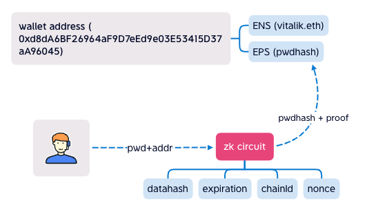
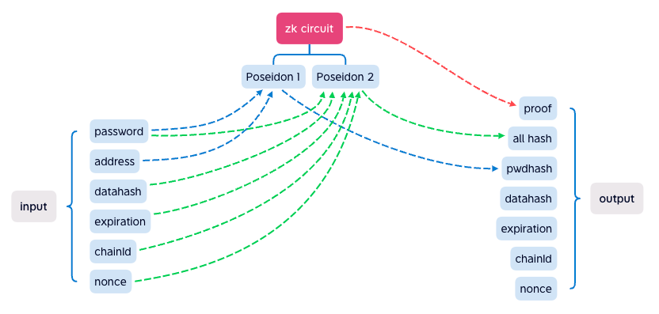

 
 

## Ethereum Password Service
#### EPS contract binding password hash to wallet address.
 

 

### How it works

User input password to EPS ZK Circuit (running at frontend), it output hash + proof, it proving that the hash is generate from the password, EPS contract can verify it, if the hash equals the one in EPS contract, that means the user input the right password.

 
 
 

 

ZK circuit hides inputs, include password, the output is verified in EPS contract. when pwdhash equals the one in EPS contract, it proves that all output values are signed with password.

The pwdhash is generate from password and wallet address, make sure that everyone's pwdhash is different. 
The all hash make (ZK) Password to sign data as PrivateKey. 
The nonce, proof can't be reused again, to avoid Double Spent. 

 
 

## FAQ
<ul>
<li>Where is the password store?

In your mind. EPS just stores password hash.

</li>
<li>When the proof is verified, can it be reuse again?

No, the next nonce will be +1, so the used proof is invalid.

</li>
<li>Can the password be cracked?

6 chars password need 70 years to crack, or 70 top computers in 1 year. 
8 chars, hundreds years.

</li>
<li>Can the password verify off chain?

Of course, it dons't cost gas off chain.  
But on chain verify, it costs a little bit gas.

</li>
<li>If I forget my password, can it be recover?

No. but you can retry many times.

</li>
</ul>
 
 