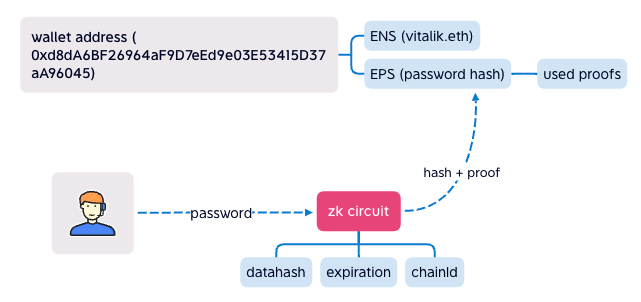

 
 

## Ethereum Password Service
#### EPS contract binding password hash to wallet address.
 

 

### How it works

User input password to EPS ZK Circuit (running at frontend), it output hash + proof, it proving that the hash is generate from the password, EPS contract can verify it, if the hash equals the one binging in EPS contract, that means the user input the right password.

Advanced, used proofs is recorded in EPS contract, to avoid Double Spent. 
And, datahash\expiration\chainId are added to ZK Circuit, make (ZK) Password to sign data as PrivateKey.

 
 

## FAQ
<ul>
<li>Where is the password store?

In your mind. EPS store password hash.

</li>
</ul>
 
 