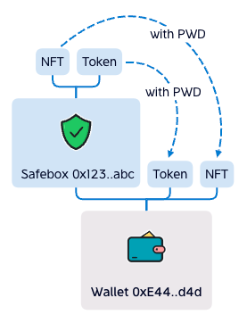

 
 

## Safebox
#### If privatekey is stolen, Safebox is still safe.
 

 

### How it works

Safebox is a Smart Contract Wallet, deployed by user. 

User holds Wallet, Wallet holds Safebox, Safebox holds Assets.

Withdraw from Safebox need the EPS Password. 
The withdraw to-address must be Safebox's owner. 
The caller must be Safebox's owner.

 
 

## FAQ
<ul>
<li>Where is the password store?

In your mind. EPS store password hash.

</li>
<li>If the project fail or be hacked, is my Safebox safe?

Yes, the Safebox is Smart Contract Wallet, you're the only owner of the contract, it's running forever and no one can control it except you.

</li>
</ul>
 
 